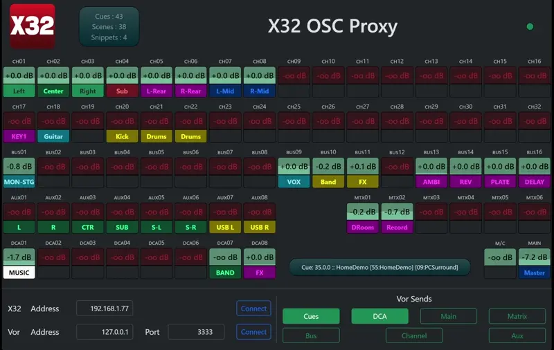

# X32 OSC Proxy

Simple app to translate X32 state to Vor OSC strings.

Also includes a helpful GUI of the state of the console, along
with some _very_ simple metering to see audio levels.

## Interface

Near the bottom you can set:

* X32 IP Address (fixed port)
* Vor IP Address
* Vor Port

Be sure to click "connect" when done, this will save your changes.

Groups to send to Vor:

* __Cue__ : Current cue - follows show control mode.  Cue will include both scene and snippet, if set.  Scene and Snippet modes only include themselves.
* __DCA__ : DCA 1-8
* __Main__ : Main (1), and Mono (2)
* __Matrix__ : Matrix 1-6
* __Bus__ : Mix Bus 1-16
* __Aux__ : Auxin 1-8
* __Channel__ : Channel 1-32

## OSC Output

All messages are a single string. _There is currently no way to customize the output format._

* __Cue__ : `/currentCue`
* __DCA__ : `/dca/[1...8]`
* __Main__ : `/main/1` (Main), `/main/2` (M/C)
* __Matrix__ : `/matrix/[1...6]`
* __MixBus__ : `/bus/[1...16]`
* __Aux__ : `/auxin/[1...8]` (7 and 8 are typically the USB player)
* __Channel__ : `/channel/[1...32]`

Messages are sent as a single OSC Message for cue, and a OSC Bundle for each of the other groups. Updates are sent approximately every 150ms.

## In Action

## License

MIT license, but really, do whatever you want. If it seems useful to others, maybe open a pull request.
