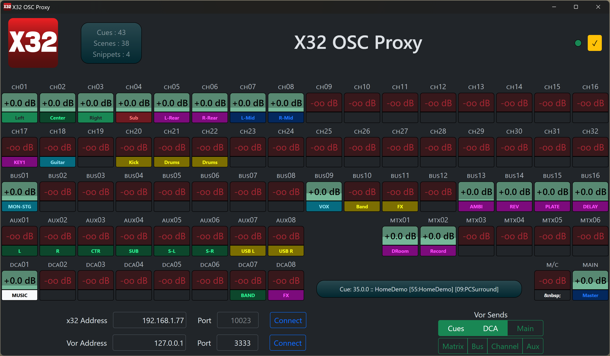

# X32 OSC Proxy

Simple app to translate X32 state to Vor OSC strings.

Also includes a helpful GUI of the state of the console, along
with some _very_ simple metering to see audio levels.

## Interface

Near the bottom you can set:

* X32 IP Address (fixed port)
* Vor IP Address
* Vor Port

Be sure to click "connect" when done, this will save your changes.

Groups to send to Vor:

* __Cue__ : Current cue - follows show control mode.  Cue will include both scene and snippet, if set.  Scene and Snippet modes only include themselves.
* __DCA__ : DCA 1-8
* __Main__ : Main (1), and Mono (2)
* __Matrix__ : Matrix 1-6
* __Bus__ : Mix Bus 1-16
* __Aux__ : Auxin 1-8
* __Channel__ : Channel 1-32

## OSC Output

All messages are a single string. _There is currently no way to customize the output format._

* __Cue__ : `/currentCue`
* __DCA__ : `/dca/[1...8]`
* __Main__ : `/main/01` (Main), `/main/02` (M/C)
* __Matrix__ : `/matrix/[01...06]`
* __MixBus__ : `/bus/[01...16]`
* __Aux__ : `/auxin/[01...08]` (7 and 8 are typically the USB player)
* __Channel__ : `/channel/[01...32]`

Messages are sent as a single OSC Message for cue, and a OSC Bundle for each of the other groups. Updates are sent approximately every 150ms.

## In Action

_Possible Gotcha:_ Note the audio level displayed is a __visualization__ based on a simple exponential expression of the linear audio level - specifically `f(x) = ( x ^ 0.35 ) / 100` - I tried several methods to convert it to decibels and then a percentage, and was unhappy with the visualization, particularly on low level signals - this method amplifies movement on the low end of the scale, pretty much the opposite of how our ears work.  All of that said, this is an effective signal visualization, and should not be interpreted as a volume level.

## Vor Configuration

Add a [Custom OSC](https://docs.getvor.app/vor/settings/connections/show-control/custom-osc) connection of type UDP.  Note that the configuration shown is from Vor version 1.6 or so, some options may look different.

By default, we uses port 3333, but you can use whatever you want.

### Add VOR addresses

Add any of the available address endpoints. Note that the fader index __is__ zero padded like it is on the X32 end - so `/channel/01`, not `/channel/1`.  Like the X32, DCA's are the exception to the rule - they are `/dca/1` through `/dca/8`

### Setup Layout

Example shown for current cue - all other endpoints follow the same pattern.

### Sample Output

## Console Coverage

Both the X32 and M32 should work fine, with all their variants.  I have a full size X32, no other products have been tested with this. From my reading, I am quite positive this will not work with the Wing or X-Air line of consoles.

## License

MIT license, but really, do whatever you want. If it seems useful to others, maybe open a pull request.
